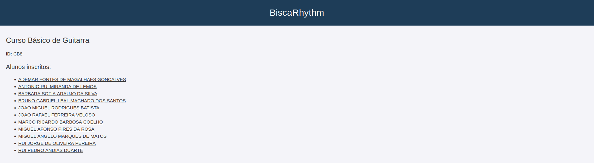

# TPC2 - Escola de Música

**Data:**  2025/02/20  

## Autor  
- **Número de Aluno:** A104537  
- **Nome:** Afonso Gonçalves Pedreira  

## Resumo  
Neste trabalho, utilizou-se o JSON `db.json` fornecido pelo docente, que foi processado pelo script `normalizer.py` para alterar todas as chaves `#text` para `text`, criando uma estrutura válida para o `json-server`. O objetivo foi criar um serviço web que disponibiliza informações sobre alunos, cursos e instrumentos da escola de música. Os dados são servidos por um `json-server` ao servidor `server.js`.  

## Resultados  

### Instruções  

### Preparar o dataset:  
```bash  
$ python normalizer.py  
```

### Iniciar o json-server:  
```bash  
$ json-server --watch db.json  
```

### Iniciar o servidor:  
```bash  
$ node server.js  
```

### Endpoints  

#### `/` - Página principal  
Apresenta uma lista de possíveis endpoints para aceder à informação sobre alunos, cursos e instrumentos.  

#### `/alunos` - Lista de todos os alunos  
Apresenta uma lista de todos os alunos registados, com links para a página individual de cada um.  

#### `/alunos/{id-do-aluno}` - Página individual de um aluno  
Apresenta informação detalhada sobre um aluno específico, incluindo nome, ID, curso e instrumento que toca.  

#### `/cursos` - Lista de todos os cursos  
Apresenta uma lista de todos os cursos disponíveis, com links para as páginas individuais de cada um.  

#### `/cursos/{id-do-curso}` - Página individual de um curso  
Apresenta informação detalhada sobre um curso, incluindo designação e a lista de alunos inscritos nele.  

#### `/instrumentos` - Lista de todos os instrumentos  
Apresenta uma lista de todos os instrumentos disponíveis, com links para as páginas individuais de cada um.  

#### `/instrumentos/{id-do-instrumento}` - Página individual de um instrumento  
Apresenta informação detalhada sobre um instrumento, incluindo o nome e a lista de alunos que o tocam.  

